#### Other My Nodes
- 📘 [ComfyUI-AK-Pack](https://github.com/akawana/ComfyUI-AK-Pack)
- 📘 [ComfyUI-AK-XZ-Axis](https://github.com/akawana/ComfyUI-AK-XZ-Axis)
- 📘 [ComfyUI RGBYP Mask Editor](https://github.com/akawana/ComfyUI-RGBYP-Mask-Editor)
- 📘 [ComfyUI Folded Prompts](https://github.com/akawana/ComfyUI-Folded-Prompts)

# ComfyUI AK Pack
This is a pack of useful ComfyUI nodes and UI extensions. It was created for **complex and large** workflows. The main goal of this pack is to unify and simplify working with my other packs: 📘 [ComfyUI-AK-XZ-Axis](https://github.com/akawana/ComfyUI-AK-XZ-Axis), 📘 [ComfyUI RGBYP Mask Editor](https://github.com/akawana/ComfyUI-RGBYP-Mask-Editor), 📘 [ComfyUI Folded Prompts](https://github.com/akawana/ComfyUI-Folded-Prompts).

The most interesting parts of this pack for most users are:
- Multiple Samplers Control
- Project Settings
- AK Base

The other nodes are also useful, but they are of secondary importance. You should be able to figure them out on your own.

I have also created example workflows:

---
#### UI: Multiple Samplers Control

This is not a node in the traditional sense, but a **ComfyUI UI extension**. The panel allows you to control multiple KSamplers or Detailers from a single place.

In my workflows, I often use 6–8 KSamplers and Detailers at the same time. I spent a long time looking for a fast and centralized way to control them, and this panel is the result of that effort.

The panel is integrated into the left toolbar of ComfyUI and can be disabled in Settings.

The panel includes a Settings tab where you configure, using comma-separated lists, which KSampler nodes you want to control. You can specify node names or node IDs in these lists.

For example: "KSampler, 12, 33, My Detailer, BlaBlaSampler" - will find all the samplers mentioned.

Once configured, the detected nodes will appear in a dropdown list in the Control tab, allowing you to adjust the settings of your KSamplers or Detailers from a single centralized interface.

| [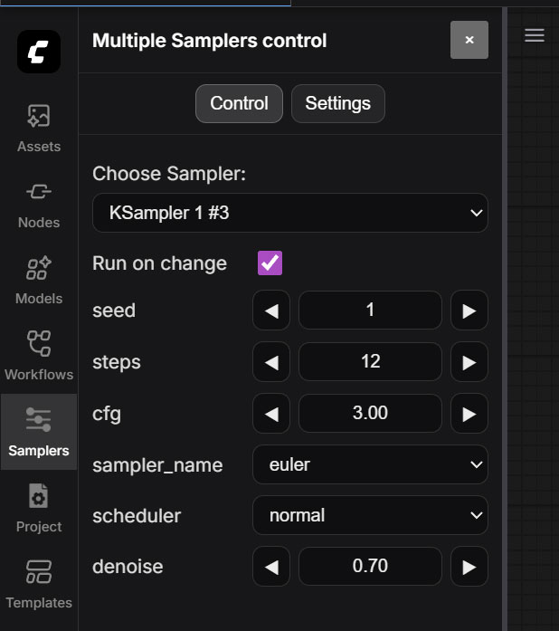](./img/MSamplers.jpg) | [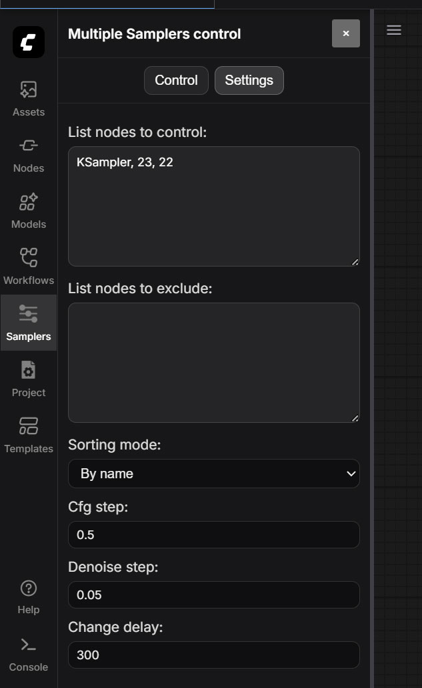](./img/MSamplersSettings.jpg) | [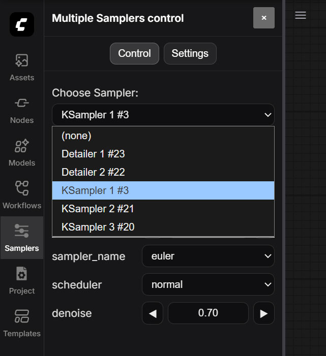](./img/MSamplersChooser.jpg) |
|---|---|---|

---
#### UI: Project Settings

This is not a node in the strict sense. It is a **UI extension** — a panel that allows you to quickly enter the main parameters of your project.
The panel is embedded into the left toolbar of ComfyUI and can be disabled in the settings.

I work a lot with img2img and often use fairly large workflows. I got tired of constantly navigating to different parts of the workflow every time I needed to adjust input parameters, so I created this panel. Now I can load an image and enter all the required values in one place.

All panel data is stored directly in the workflow graph, except for the image itself. **The image** is copied to the **input/garbage/** folder. If you delete this folder later, nothing bad will happen — you will simply need to select the image again.

To retrieve the data from this panel, I created a separate node called **AKProjectSettingsOut**. Just place it anywhere you need in your workflow to access the panel values.

| [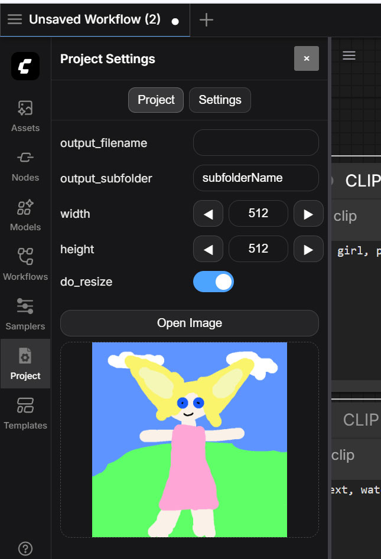](./img/ProjectSettings.jpg) | [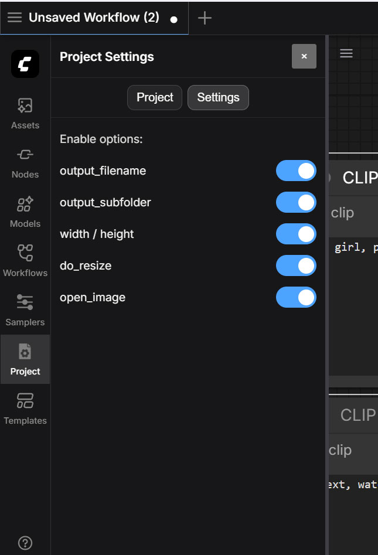](./img/ProjectSettingsOptions.jpg) | [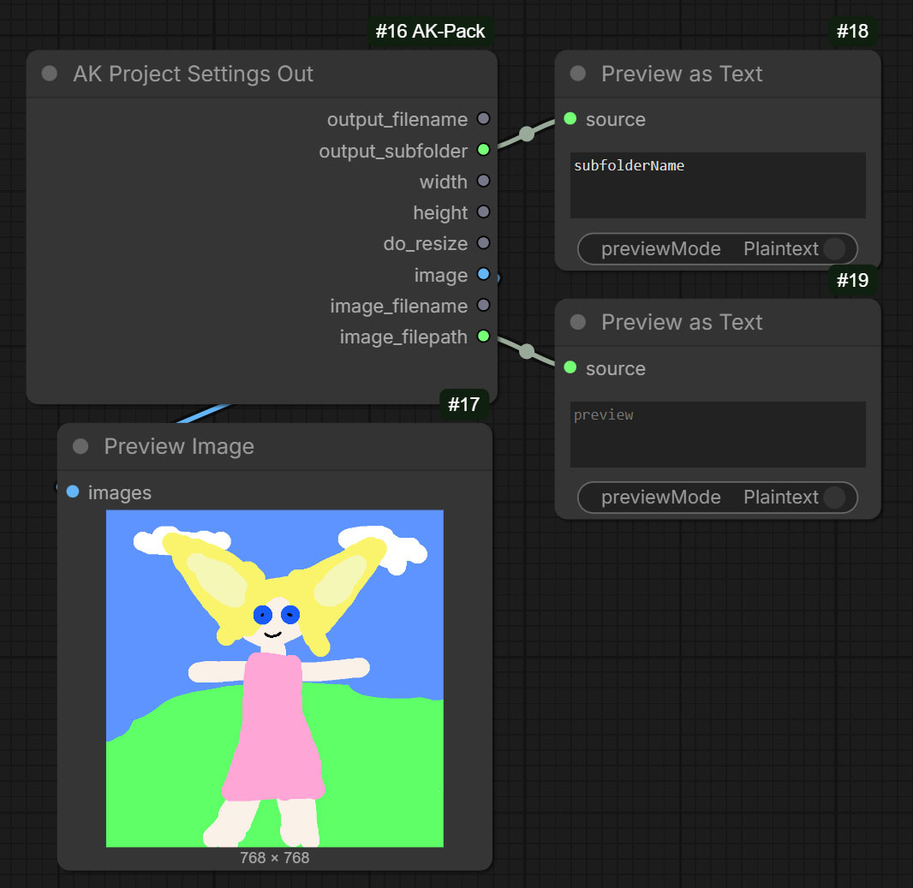](./img/AKProjectSettingsOut.jpg) |
|---|---|---|

---
#### Node: AK Base

This node is designed as a central hub for working within a workflow, which is why it is called AK Base. At its core, it provides a preview-based comparison of two images. Similar nodes already exist, but this one adds support for a gallery of multiple images.

In addition, it includes:
- a button to copy a single image to the clipboard,
- a button to copy the entire gallery to the clipboard,
- a dialog that allows you to inspect the results while working in a different part of the workflow.

In the Properties panel, this node provides a setting called node_list.
This is a text field where you can specify a list of nodes, using either node names or node IDs.

Once configured, AK Base can automatically adjust the parameters seed, denoise, cfg, and xz_steps based on the image selected in the gallery.
This functionality was implemented specifically to support my 📘 [ComfyUI-AK-XZ-Axis](https://github.com/akawana/ComfyUI-AK-XZ-Axis) nodes.

| [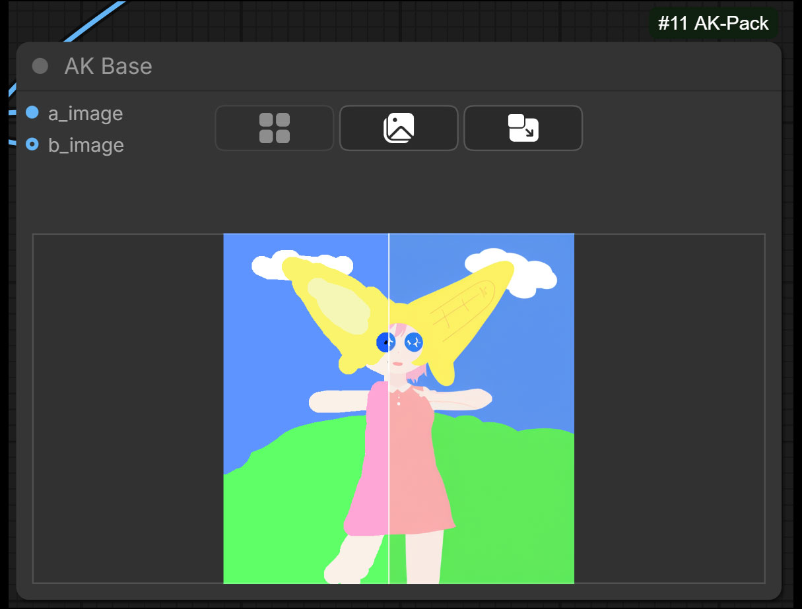](./img/AKBase.jpg) | [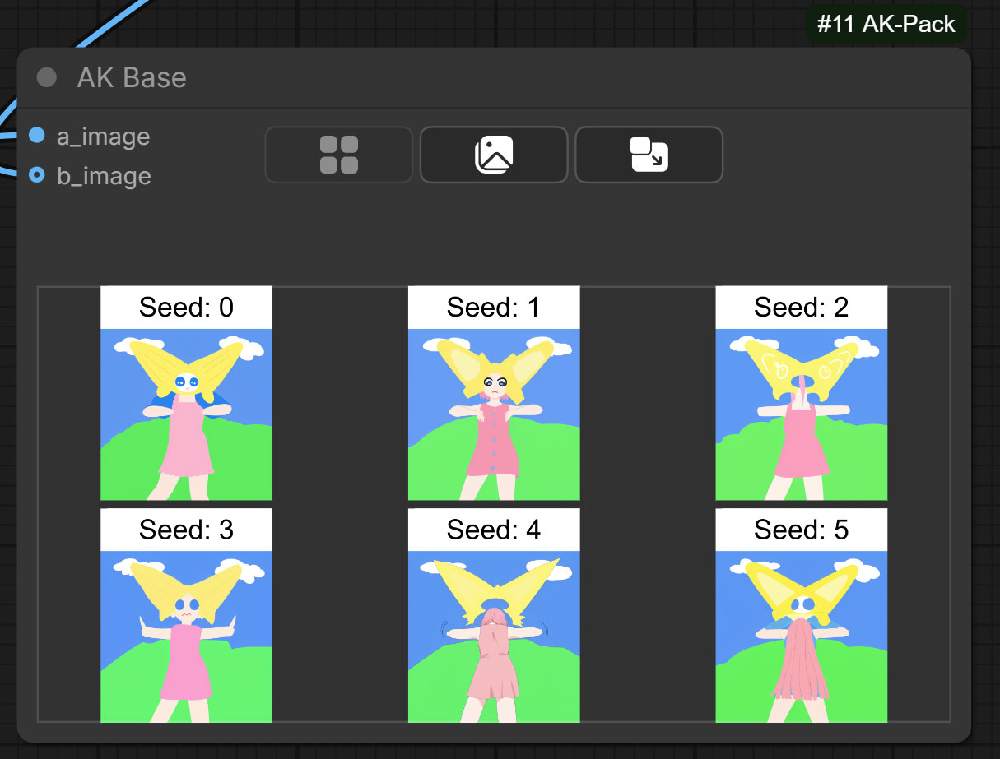](./img/AKBaseGallery.jpg) | [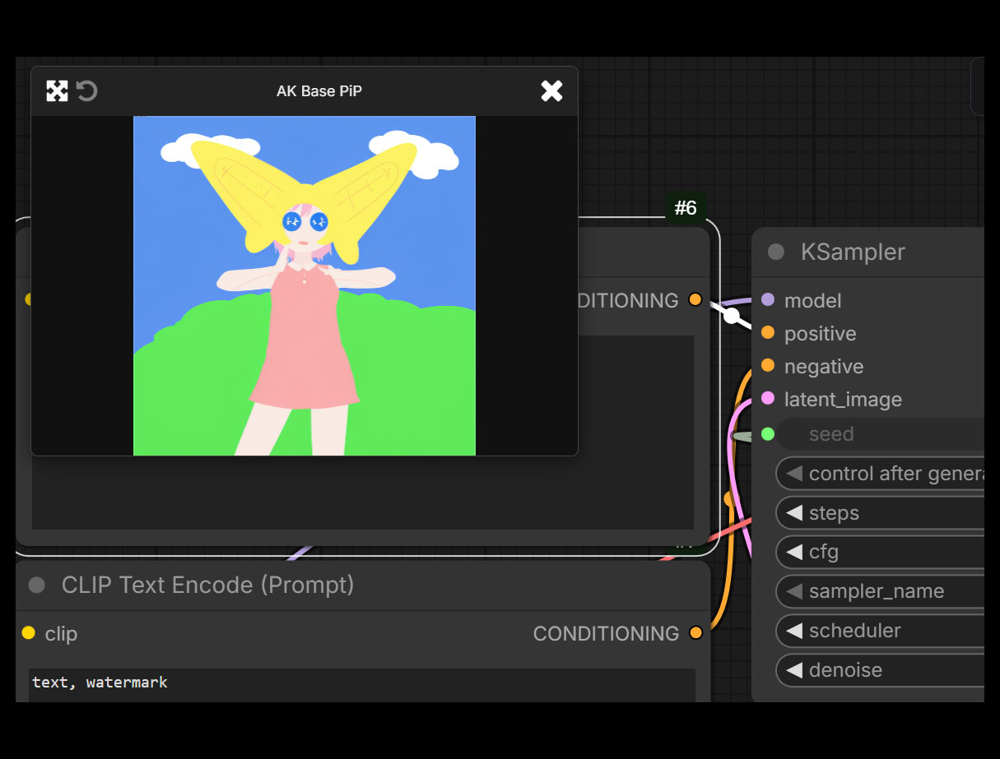](./img/AKBasePIP.jpg) |
|---|---|---|

---
#### Node: Setter & Getter

These nodes already exist in several other packs. My goal was to make them faster. In my implementation, the nodes do not use JavaScript to store or pass data. All data is passed only through Python and direct connections between nodes. Simply put, they hide links and hide outputs and inputs. 

In my setup, JavaScript is responsible only for updating the list of variables and does not affect the Run process in any way. Based on my comparisons, in complex workflows with 20–30 Getter/Setter nodes, my nodes perform much faster.

---
#### Node: Repeat Group State

A connection-free interactive node that synchronizes the state of its own group with the state of other groups matching a given substring. This allows groups to depend on other groups without wires, similar to rgthree repeaters.

- Finds groups with names containing the target substring.
- Checks whether any of them are Active.
- If **all** matching groups are disabled -> it disables **its own group**.
- If **any** matching group is active -> it enables **its own group**.

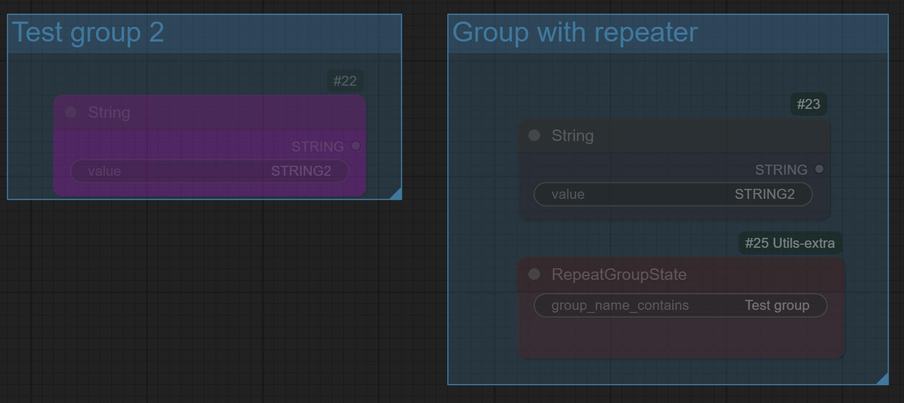

---
#### Node: IsOneOfGroupsActive

Checks the state of all groups whose names **contain a specified substring**.  

- If **at least one** matching group is Active -> output is `true`.  
- If **all** matching groups are Muted/Bypassed -> output is `false`.

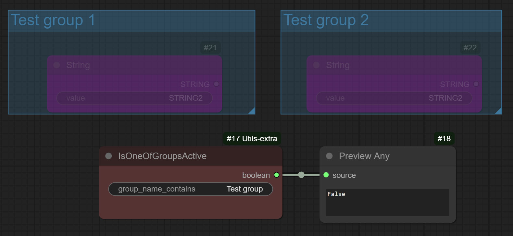

---
#### Node: AK Index Multiple

Extracts a specific range from any **List** (images, masks, latents, text etc..) and creates individual outputs for that range.  
Optionally replaces missing values with a fallback (`if_none`).

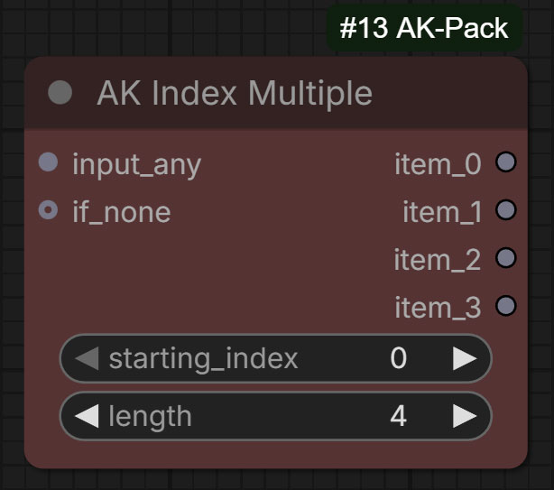

---
#### Node: AK CLIP Encode Multiple

Extracts a specific range from any **List** of strings and CLIP encodes individual outputs for that range.  

Same as **AK Index Multiple** but for CLIP encoding. Works faster than regular CLIP Encoders because does only one encoding for all NONE input strings. Caches the stings and does not encode them if no changes. Also outputs combined conditioning.

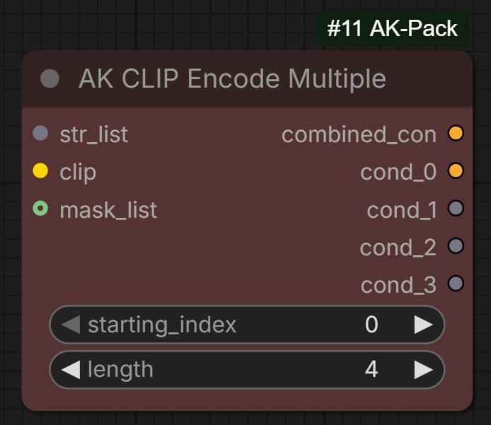

---
#### Node: AK KSampler Settings & AK KSampler Settings Out

Allows you to define sampler settings anywhere in the workflow.
The Out node lets you retrieve these settings wherever they are needed.

- `Seed`, `Sampler`, `Scheduler`, `Steps`, `Cfg`, `Denoise`, `xz_steps`

> [!NOTE]
> This node includes an additional field called xz_steps.
> It is used to control the number of steps when working with my 📘 [ComfyUI-AK-XZ-Axis](https://github.com/akawana/ComfyUI-AK-XZ-Axis) nodes.
> This field is also convenient when used together with the **AK Base** node, because it can automatically set xz_steps = 1 when a single image is selected in the gallery.

---
#### Node: AK Replace Alpha With Color & AK Replace Color With Alpha

`AK Replace Alpha With Color` Replaces alpha with a color.

`AK Replace Color With Alpha` Performs the reverse operation: Replaces a color with alpha. You can specify the color manually, or use automatic modes that detect the color from pixels in different corners of the image. Image **cropping** is also available. This is useful because when rendering images on a flat background, the outermost pixels around the edges often have color artifacts and are better removed.

> [!NOTE]
> Both of these nodes are useful when working with images that have a transparent background. You can first replace alpha with a color, perform the generation, and then, before saving, remove that color and convert it back to alpha.

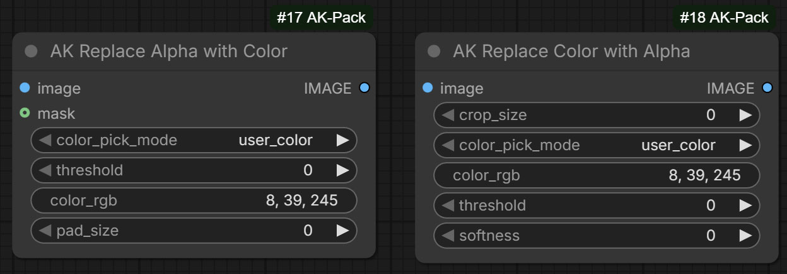

---
#### Other nodes

##### Node: AK Pipe & AK Pipe Loop

AK Pipe is a zero-copy pipeline node that passes a structured pipe object through the graph and updates only explicitly connected inputs. It avoids unnecessary allocations by reusing the original pipe when no values change and creates a new container only on real object replacement. This design minimizes memory churn and Python overhead, making it significantly faster than traditional pipe merge nodes.

`AK Pipe Loop` Always outputs the most recently modified connected AK Pipe.

##### Node: CLIP Text Encode Cached

Simple node for encoding conditioning with a small caching experiment.

##### Node: CLIP Text Encode and Combine Cached

Can combine the input conditioning with the text entered in the node.

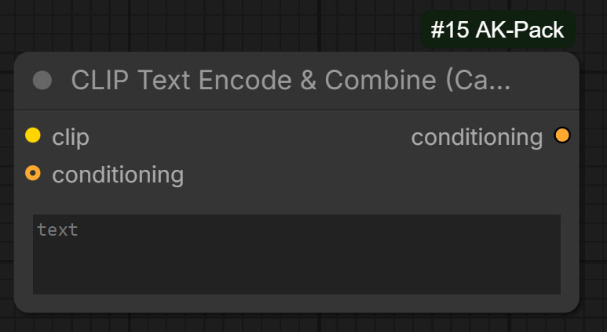

##### Node: AK Resize On Boolean

Resizes the image and optional mask based on a boolean parameter (enable / disable). Useful when working with the **Project Settings** panel.

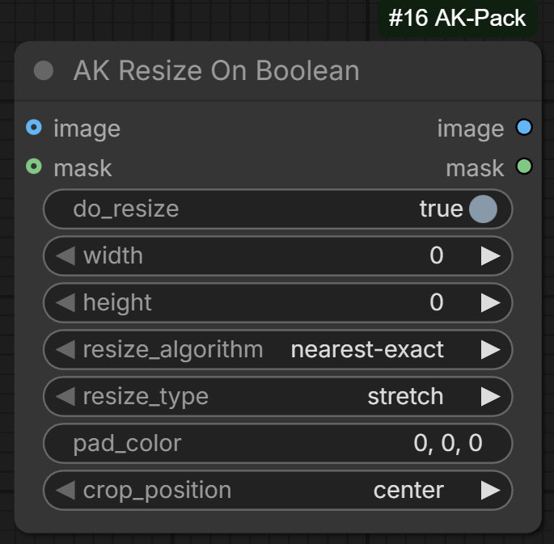

##### Node: AK Contrast And Saturate Image

Node for adjusting image contrast and saturation.

##### Node: Preview Raw Text

Displays text and can format **JSON**. It also supports displaying a list of texts.

---

# Installation

From your ComfyUI root directory:

```bash
cd ComfyUI/custom_nodes
git clone https://github.com/akawana/ComfyUI-Utils-extra.git